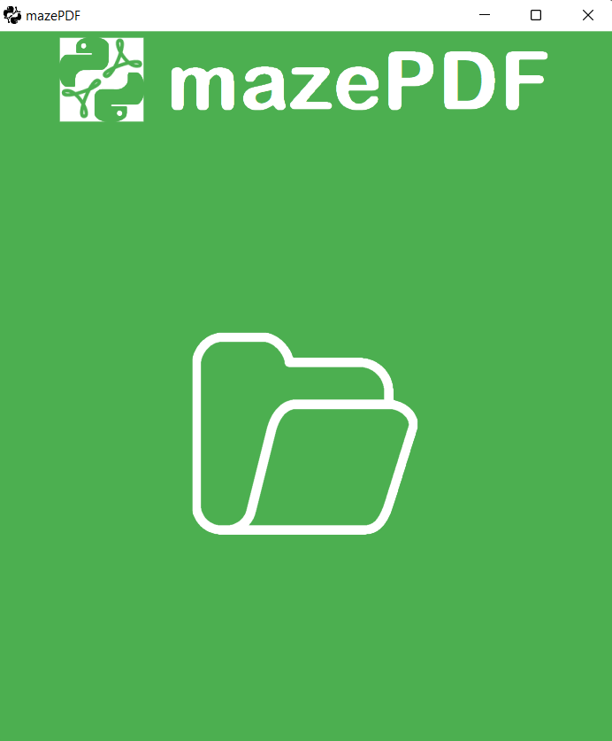
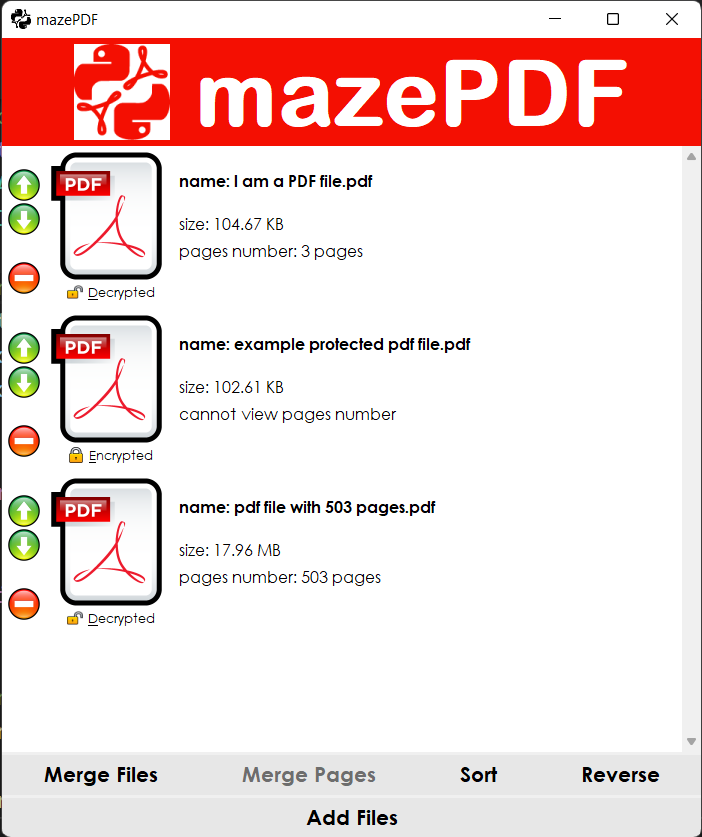
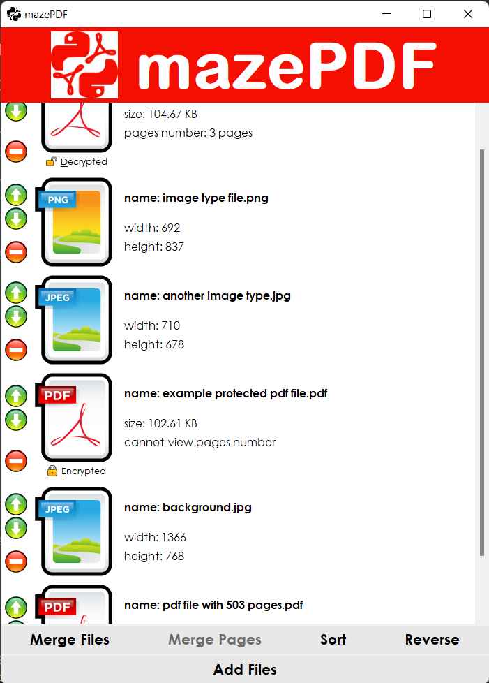
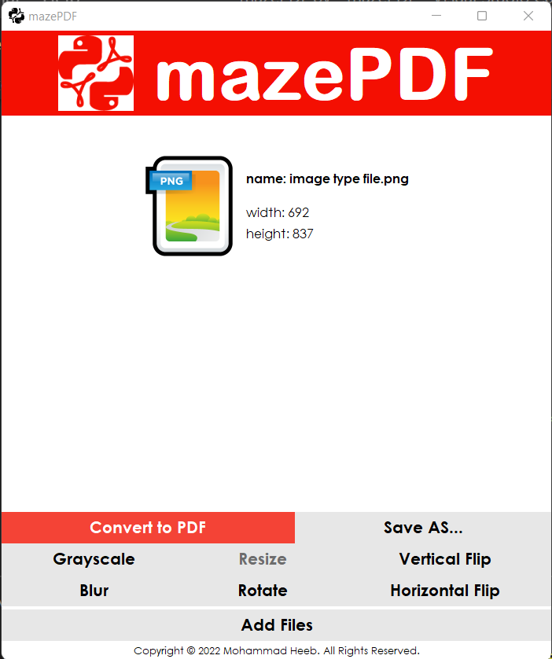

# **mazePDF**
## _Graphical user interface to work with **PDF** files_
### by: ***Mohammad Heeb***
 

#### **to start** you need to
1. [**download python**](https://www.python.org/) (version 3.6 or later).
2. get the needed python libraries ([**tkinter**](https://docs.python.org/3/library/tkinter.html), [**PyPDF2**](https://pypi.org/project/PyPDF2/), [**PIL**](https://pypi.org/project/Pillow/)) installed.
3. download the repository files.
4. run [***mazePDF.py***](./mazePDF.py) with the command line: 
> `python mazePDF.py`

### _thats all, you are good to go!_
 

#### _using **mazePDF** you can_:
+ merege the supported file types into single pdf file.
+ add, remove and arrange files visually.
+ reduce pdf file size: quick compress, hard compress and remove images.
+ pdf metadata view and clear
+ work with images: resize, rotate, flip, grayscale, blur and convert to pdf or save as another image type.

 

 

 

***

### _future features:_
- [ ] more pdf files controllers (encrypt and decrypt, add numbers to pages, stamp and watermark, extract text, extract links, edit pages and more).
- [ ] zip files support (extract files directly into mazePDF).
- [ ] status bar to view status update, app footer.
- [ ] change main theme (mazePDF logo and main browse button).
- [x] choose display mode (DARK or LIGHT).
